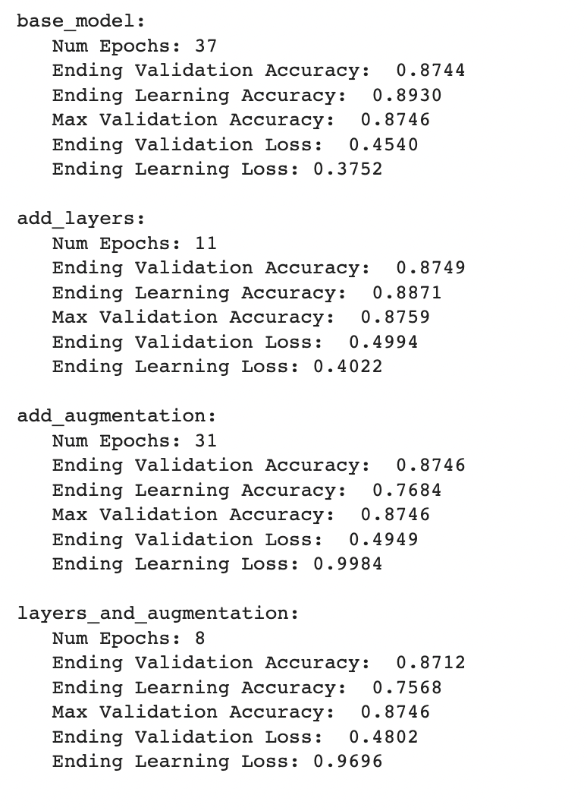

# Dog_Breed_Categorization

### Topic:
- Image classification for dog breeds.

### Purpose:
- Sometimes people are out and about when they see a cute dog that they know nothing about but would like to. My group and I are working on a project that can help people identify a dog's breed based off an image. Our goal is to create a web app that can help people identify what type of dog they run into, and share some basic information about the breed type.  [Try it out!](http://dogbreedpredictor.com)

### Tools Used:
- Flask web app
- Tensorflow
- Tensorflow Hub
- Numpy
- Jupyter Notebook 
- Pandas
- Matplotlib.pyplot
- PIL
- Joblib (used for a model save, but we ended up using the .h5 file instead)
- Tools for Website Hosting:
    - gunicorn
    - Nginx

### Data Sources:
- Images of 120 different dog breeds with multiple images per breed type provided by:
    - https://www.kaggle.com/datasets/jessicali9530/stanford-dogs-dataset

- A csv file listing all the different dog breeds and their attributes
    - akc-data-latest.csv 
    - Downloaded from the following GitHub profile:
        - https://github.com/tmfilho/akcdata
        - License for the data: https://github.com/tmfilho/akcdata/blob/master/LICENSE 

### Communication:
- Tuesday/Thursday during regular class zoom meets
- Zoom meets outside of class (as necessary)
- Slack messages

### Machine Learning:
- For our project, the machine learning algorithm we decided to work with is a deep neural network, as we are trying to train the machine to recognize images of dogs to then predict what breed a specific dog image belongs to. We have attempted to try and build our own deep neural network from scratch, but have failed to reach any kind of decent accuracy with those attempts. Since we were unable to get higher than 15% accuracy while building our own model from scratch, we decided to use a transfer learning model which has already been trained with large and generalized datasets. There are multiple different transfer learning models available, so we will try a few different ones which will be enhanced with our specific data, and pick one that gives us the best results. Our goal is to use a model that will give us 80% validation accuracy with our testing data.
- Below is a summary of our results from experimenting with multiple transfer learning models.

- The model summaries above show that each of the models we tested performed similarly, with the biggest difference being the number of epochs it took to get them to their ending accuracies. Our group has decided to use the “add_layers” model which doesn’t use any data augmentation, but does add a couple of dense layers after the transfer learning output but before the final prediction. The model we have chosen was able to achieve a validation accuracy above our required limit of 80%, while keeping the learning and validation accuracies approximate to each other. This model also avoided the overfitting situation where the learning data got very accurate but the testing data stayed the same, and the opposite, where the validation accuracy was high but learning couldn’t quite reach the desired accuracy. We were mainly focused on getting the validation accuracy as high as possible, but were pleased to see that our model was able to keep the losses fairly low as well. 

### Deployment of Machine Learning Model through the Web App:
- To connect our machine learning model to our website and make it functionable, we created a flask app which we were then going to host through Heroku. While trying to accomplish the deployment, we found that the saved machine learning model was too large and used too much memory to work through Heroku, so we decided to go another route and try hosting through GoDaddy web hosting services. The GoDaddy web hosting service was able to provide more memory usage, but it was still not enough to be able to deploy and use our saved machine learning model. Since we weren’t able to go that route, we received help from a server and storage expert (team member Emily's husband) and were able to host the website through a virtual machine. In order to share the website, we did use the GoDaddy domain services and were able to purchase the domain name, dogbreedpredictor.com.

### Conclusion:
- Success:
    - We were able to create a successful machine learning model for pure bred dog images. However, the model does seem to have difficulty placing mixed breed dogs properly, as seems to be the case with multiple machine learning algorithms we have tried during the exploration phase of the machine learning process. Although the machine learning algorithm we used isn’t perfect when it comes to predicting a mixed breed dog’s breed, it does recognize that issue by sharing the confidence level, in percentage, of how accurately the breed was predicted.
- Improvements:
    - We believe that with further work, we could possibly achieve better results for mixed breed dogs, by doing the following:
        - Add more or better data (images) for training purposes.
        - Using the annotations included with the dog image data.
            - This would essentially crop each data image used for training to specifically focus on pixels in the image related only to the dog.
